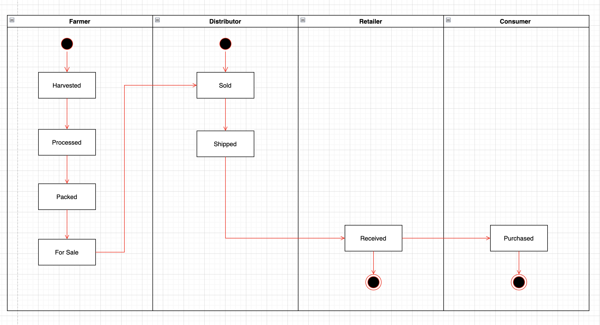
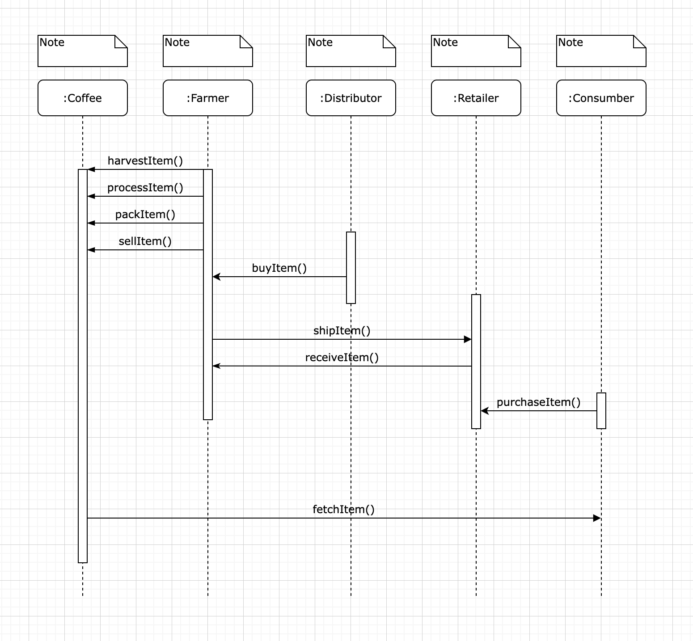
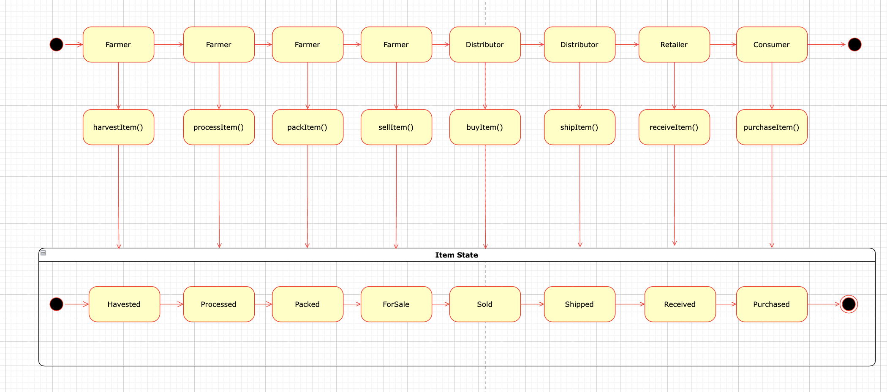
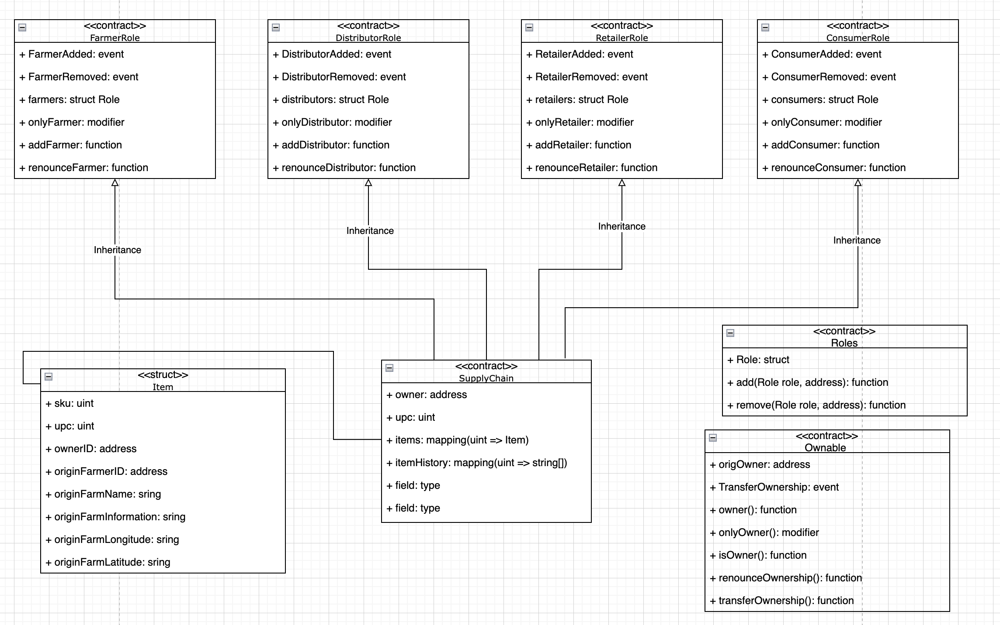

# Report: https://rinkeby.etherscan.io/address/0x24F4900cA7a92103ccE499334f2FB5a91a5150ab

# UML
# Activity

# Sequence

# State

# Class Diagram

Truffle v5.5.18 (core: 5.5.18)
Ganache v7.2.0
Solidity v0.5.16 (solc-js)
Node v14.17.1
Web3.js v1.5.3

Deployment log

Compiling your contracts...
===========================
> Everything is up to date, there is nothing to compile.

Starting migrations...
======================
> Network name:    'rinkeby'
> Network id:      4
> Block gas limit: 30000000 (0x1c9c380)

1_initial_migration.js
======================

   Deploying 'Migrations'
   ----------------------
   > transaction hash:    0x7f78ac4a70d2122252c6fba6e3b6b39192cd5235452ec224acab091f4c459c12
   > Blocks: 1            Seconds: 17
   > contract address:    0x0b6ee905dC4776bA1bf79F08b480adEC04e14b09
   > block number:        11004447
   > block timestamp:     1657524722
   > account:             0x183DdA6bE68413a8C5d77e43019E53099eaD9C58
   > balance:             0.031174265786581847
   > gas used:            274088 (0x42ea8)
   > gas price:           1.500000012 gwei
   > value sent:          0 ETH
   > total cost:          0.000411132003289056 ETH

   Pausing for 2 confirmations...

   -------------------------------
   > confirmation number: 1 (block: 11004448)
   > confirmation number: 2 (block: 11004449)
   > Saving migration to chain.
   > Saving artifacts
   -------------------------------------
   > Total cost:     0.000411132003289056 ETH

2_deploy_contracts.js
=====================

   Deploying 'FarmerRole'
   ----------------------
   > transaction hash:    0xc3b6608550f6baf72511429bb2a01d9f5110ec5700f547a227b4e2983af53597
   > Blocks: 2            Seconds: 22
   > contract address:    0xb50931287F8D9704d844B643132D5cee0d061ae1
   > block number:        11004452
   > block timestamp:     1657524797
   > account:             0x183DdA6bE68413a8C5d77e43019E53099eaD9C58
   > balance:             0.030609403282108882
   > gas used:            330640 (0x50b90)
   > gas price:           1.500000012 gwei
   > value sent:          0 ETH
   > total cost:          0.00049596000396768 ETH

   Pausing for 2 confirmations...

   -------------------------------
   > confirmation number: 1 (block: 11004453)
   > confirmation number: 2 (block: 11004454)

   Deploying 'DistributorRole'
   ---------------------------
   > transaction hash:    0xec903067107abaabc22a9f12f7d4e7ba4232be4e25065d55160690ee32980468
   > Blocks: 1            Seconds: 9
   > contract address:    0x795a49B25933502afbdae7e09c402e65A7CDd93A
   > block number:        11004455
   > block timestamp:     1657524842
   > account:             0x183DdA6bE68413a8C5d77e43019E53099eaD9C58
   > balance:             0.030105716777743599
   > gas used:            335791 (0x51faf)
   > gas price:           1.500000013 gwei
   > value sent:          0 ETH
   > total cost:          0.000503686504365283 ETH

   Pausing for 2 confirmations...

   -------------------------------
   > confirmation number: 1 (block: 11004456)
   > confirmation number: 2 (block: 11004457)

   Deploying 'RetailerRole'
   ------------------------
   > transaction hash:    0xba8ca071ed75be8aac9895301e1fc5ff5f0c84f13dc3a443582f6e0a43d19965
   > Blocks: 2            Seconds: 23
   > contract address:    0xfc881b5c32eeE76345b323EdCE0fe7C2FA029764
   > block number:        11004459
   > block timestamp:     1657524902
   > account:             0x183DdA6bE68413a8C5d77e43019E53099eaD9C58
   > balance:             0.029602030273714107
   > gas used:            335791 (0x51faf)
   > gas price:           1.500000012 gwei
   > value sent:          0 ETH
   > total cost:          0.000503686504029492 ETH

   Pausing for 2 confirmations...

   -------------------------------
   > confirmation number: 1 (block: 11004460)
   > confirmation number: 2 (block: 11004461)

   Deploying 'ConsumerRole'
   ------------------------
   > transaction hash:    0x4bcc2cee7b6b6d06e85b4ad6552deab1753142a928b42a3498e117863de2bbba
   > Blocks: 1            Seconds: 9
   > contract address:    0x93dE767Ed14c9Bcf685337a0E44Dc4d4F44e48fc
   > block number:        11004462
   > block timestamp:     1657524947
   > account:             0x183DdA6bE68413a8C5d77e43019E53099eaD9C58
   > balance:             0.029098343769684615
   > gas used:            335791 (0x51faf)
   > gas price:           1.500000012 gwei
   > value sent:          0 ETH
   > total cost:          0.000503686504029492 ETH

   Pausing for 2 confirmations...

   -------------------------------
   > confirmation number: 1 (block: 11004463)
   > confirmation number: 2 (block: 11004464)

   Deploying 'SupplyChain'
   -----------------------
   > transaction hash:    0x2ccb5baf62407168cf82294445f5cfbb1d423ffeef7bc7f4eb2267770e7267fe
   > Blocks: 1            Seconds: 13
   > contract address:    0x24F4900cA7a92103ccE499334f2FB5a91a5150ab
   > block number:        11004465
   > block timestamp:     1657524992
   > account:             0x183DdA6bE68413a8C5d77e43019E53099eaD9C58
   > balance:             0.024627281733916119
   > gas used:            2980708 (0x2d7b64)
   > gas price:           1.500000012 gwei
   > value sent:          0 ETH
   > total cost:          0.004471062035768496 ETH

   Pausing for 2 confirmations...

   -------------------------------
   > confirmation number: 1 (block: 11004466)
   > confirmation number: 2 (block: 11004467)
   > Saving migration to chain.
   > Saving artifacts
   -------------------------------------
   > Total cost:     0.006478081552160443 ETH

Summary
=======
> Total deployments:   6
> Final cost:          0.006889213555449499 ETH

